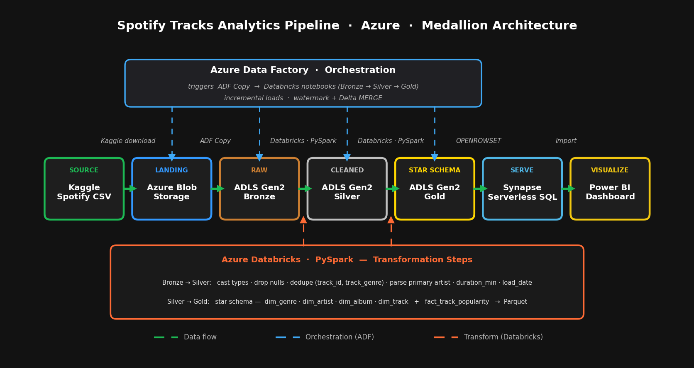
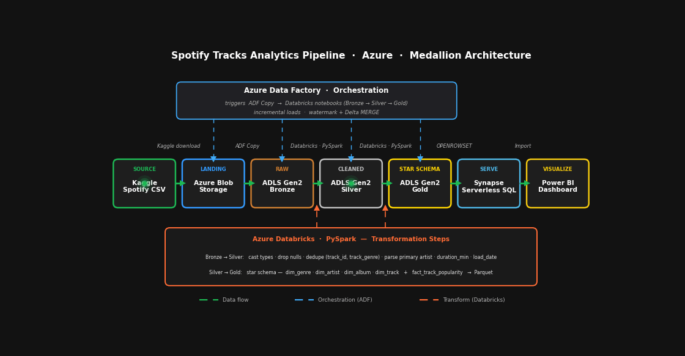
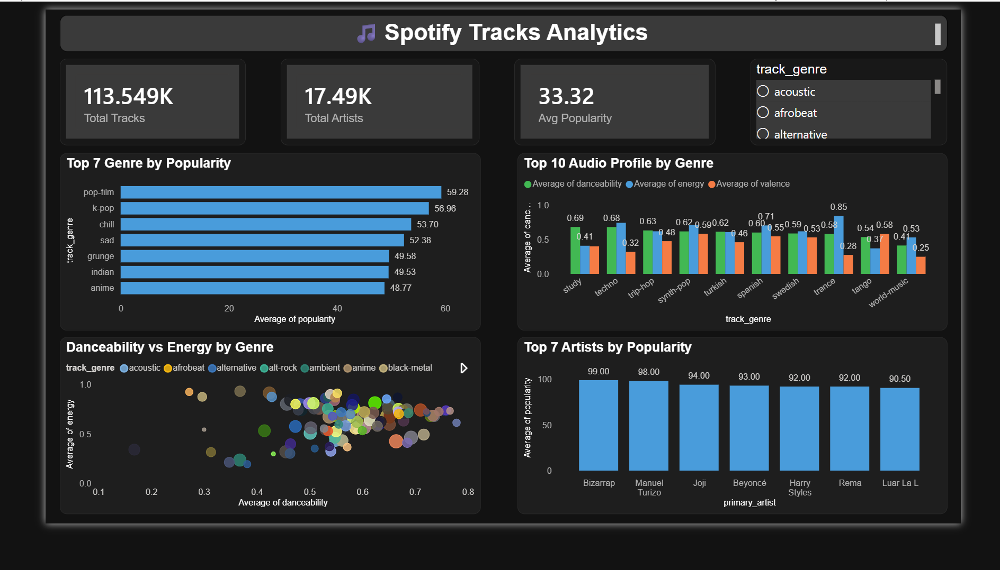

# 🎵 Spotify Tracks Analytics Pipeline — Azure (Medallion Architecture)

An end-to-end **data engineering project** on Microsoft Azure that ingests raw Spotify track data, transforms it through a **Medallion (Bronze → Silver → Gold)** architecture, models it into a **star schema**, and serves it to an interactive **Power BI** dashboard — all orchestrated with **Azure Data Factory** and built to be **cost-efficient** (the entire pipeline runs for under $5).

---

## 📊 Architecture



**Live data flow:**



---

## How It Works

| Stage | Service | What happens |
|-------|---------|--------------|
| **Ingestion** | Azure Blob → ADLS Gen2 (via ADF Copy) | Raw Spotify CSV lands in the data lake |
| **Bronze** | ADLS Gen2 | Raw data as ingested |
| **Silver** | Azure Databricks (PySpark) | Type casting, null handling, de-duplication, primary-artist parsing |
| **Gold** | Azure Databricks (PySpark) | Dimensional **star schema** (dimensions + fact), written as Parquet |
| **Serving** | Azure Synapse Serverless SQL | Gold Parquet exposed as SQL views via `OPENROWSET` |
| **Visualization** | Power BI | Interactive dashboard over the served data |
| **Orchestration** | Azure Data Factory | Triggers the Copy activity and Databricks notebooks in sequence |

### Data model (Gold layer — star schema)
- **Fact:** `fact_track_popularity` (grain = track × genre) — popularity, danceability, energy, valence, tempo, etc.
- **Dimensions:** `dim_genre`, `dim_artist`, `dim_album`, `dim_track`

---

## Tech Stack

`Azure Blob Storage` · `ADLS Gen2` · `Azure Data Factory` · `Azure Databricks` · `PySpark` · `Azure Synapse Analytics (Serverless SQL)` · `Power BI` · `SQL`

---

## 📈 Dashboard

Built in Power BI over 114,000 tracks across 125 genres — genre popularity rankings, audio-feature profiles, artist analytics, and a danceability-vs-energy relationship view, with an interactive genre slicer.



---

## 📂 Repository Structure

```
spotify-tracks-analytics/
├── README.md
├── notebooks/
│   ├── 01_bronze_to_silver.py     # Clean & standardize raw data -> Silver (Delta)
│   └── 02_silver_to_gold.py       # Build star schema -> Gold (Parquet)
├── synapse/
│   └── create_gold_views.sql      # Serverless SQL views over the Gold layer
├── diagrams/
│   ├── architecture_diagram.png
│   └── pipeline_flow.gif
└── powerbi/
    ├── spotify_analytics.pbix
    └── dashboard_screenshot.png
```

---

## How to Reproduce

1. **Provision** (one resource group): a Storage account (ADLS Gen2, hierarchical namespace on) with `landing` / `bronze` / `silver` / `gold` containers, an Azure Databricks workspace, an Azure Data Factory, and an Azure Synapse workspace (Serverless only).
2. **Ingest:** upload the dataset to `landing`, then use an ADF Copy activity to move it to `bronze`.
3. **Transform:** run `notebooks/01_bronze_to_silver.py` then `notebooks/02_silver_to_gold.py` in Databricks (fill in your storage account name and key).
4. **Serve:** grant the Synapse workspace Managed Identity the **Storage Blob Data Reader** role on the storage account, then run `synapse/create_gold_views.sql`.
5. **Orchestrate:** wire the Copy activity → the two notebooks into a single ADF pipeline.
6. **Visualize:** connect Power BI to the Synapse Serverless endpoint (`spotify_gold` database) and build the dashboard.

> Dataset: [Spotify Tracks Dataset on Kaggle](https://www.kaggle.com/datasets/maharshipandya/-spotify-tracks-dataset) 

---

## 💡 Design Highlights

- **Cost-efficiency by design:** Synapse **Serverless** (pay-per-query) instead of a dedicated pool, auto-terminating Databricks compute, single-region LRS storage — total run cost under **$5**.
- **Medallion architecture:** clear separation of raw / cleaned / business-ready layers.
- **In-place serving:** Synapse queries the Gold Parquet files directly via `OPENROWSET` — no data duplication into a warehouse.
- **Managed Identity auth:** Synapse reads storage through its workspace identity, so BI tools can query the views securely.

---

## What I Learned

- Wiring together the core services of a modern Azure data platform end to end.
- Handling real-world data issues (CSV parsing with embedded delimiters, de-duplication, star-schema modeling).
- Serving a data lake with Synapse Serverless and connecting it to Power BI.

- 👤 Author

Dhruv Patel — Data Engineer
[🔗 LinkedIn](https://www.linkedin.com/in/dhruvjayeshbhaipatel)


---

*Open to data engineering opportunities. Feedback and suggestions are always welcome.*
